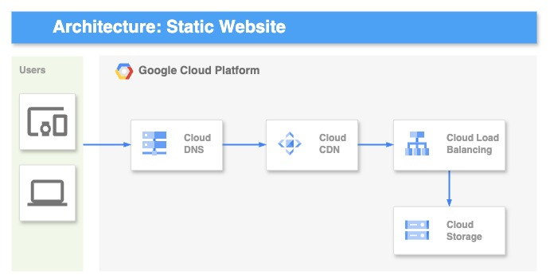
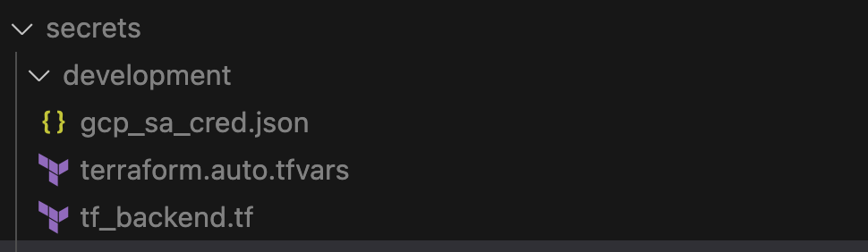

- # Static Website on Google Cloud Platform (GCP)

   This project sets up a static website on Google Cloud Storage, using a global static IP address, Cloud CDN, and a load balancer to serve content efficiently.

- # Architecture Overview
   

   The setup includes:

   ✅ A Google Cloud Storage bucket for hosting static files.

   ✅ A Cloud CDN-enabled Load Balancer to cache and accelerate content delivery.

   ✅ A global static IP address for a consistent access point.

   ✅ A URL map, HTTP proxy, and forwarding rule for routing traffic.


- # Prerequisites
    Before deploying, ensure you have:

    1. **A Google Cloud Platform (GCP) account**: with billing enabled and project.

    2. **Terraform**: Install [Terraform](https://developer.hashicorp.com/terraform/install) to manage infrastructure as code.

    3. **tfenv**: Make sure [tfenv](https://github.com/tfutils/tfenv) is installed to easily select the correct Terraform version as specified in the repository settings.

    4. **gcloud**:  [Google Cloud CLI](https://cloud.google.com/sdk/docs/install-sdk) installed and authenticated:
       ```
       gcloud auth login
       gcloud config set project <YOUR_PROJECT_ID>
       ```
    5. **GCP Service Account**: Ensure the creation of an [IAM service account](https://cloud.google.com/iam/docs/keys-create-delete#iam-service-account-keys-create-gcloud) in GCP with the necessary permissions to deploy the resources.

    6.  **Bash**: The provisioning process uses a Bash glue script(`bin/deploy.sh`) to automate Terraform and other required actions.

    7. A cloud storage bucket for terrafrom state. Please refer to this [document](https://cloud.google.com/docs/terraform/resource-management/store-state).


- # Environment Seup:
     All environment-specific configurations are stored in the `secrets` folder, while the Terraform modules provide a common setup across all environments. Specify the deployment environment (e.g., development, staging, production).

- # Managing Sensitive Data
  Sensitive values, such as API keys and secrets, are stored securely in the secrets folder. Ensure that this folder contains the necessary files in the correct formats. 
  
  Importantly, do not push the `secrets` folder to GitHub. The `secrets` folder is provided here only as a reference on how to structure sensitive information. These files should be stored securely in a vault, such as LastPass, or encrypted using a tool like git-crypt to protect sensitive data.

  

  Sample sorage backend (tf_backend.tf) file.
   ```
   terraform {
     backend "gcs" {
       bucket = "my-sample-gcp-terraform-state-bucket"
       prefix = "terraform/<environment>.state"
     }
   }
   ```

  Sample terraform.auto.tfvars file.
  ```
  project_id = "development-xxxxxx"
  ```
- # Provisioning Steps

   This application uses an automated provisioning process driven by a Bash script. Simply use the following command to deploy, update, or destroy resources based on the desired environment.

   1. Clone the Repository
      ```
      git clone git@github.com:dushanprojects/GCP_Static_Website.git
      cd GCP_Static_Website
      ```

   2. Review and Plan Changes
      ```
      bash bin/deploy.sh development plan
      ```

   3. Deploy the Resources
      ```
      bash bin/deploy.sh development apply
      ```

- # ***Accessing the Website***

  *Once deployed, you can access the website using:*

  *🌍 ****Static IP****:*

  ```sh
  http://<static_ip>
  ```

  *🌍 ****Custom Domain****:*

  ```sh
  https://yourdomain.com
  ```


- # ***Cleaning Up***

  *To delete all resources and avoid unnecessary costs:*

  ```sh
  bash bin/deploy.sh development destroy
  ```      